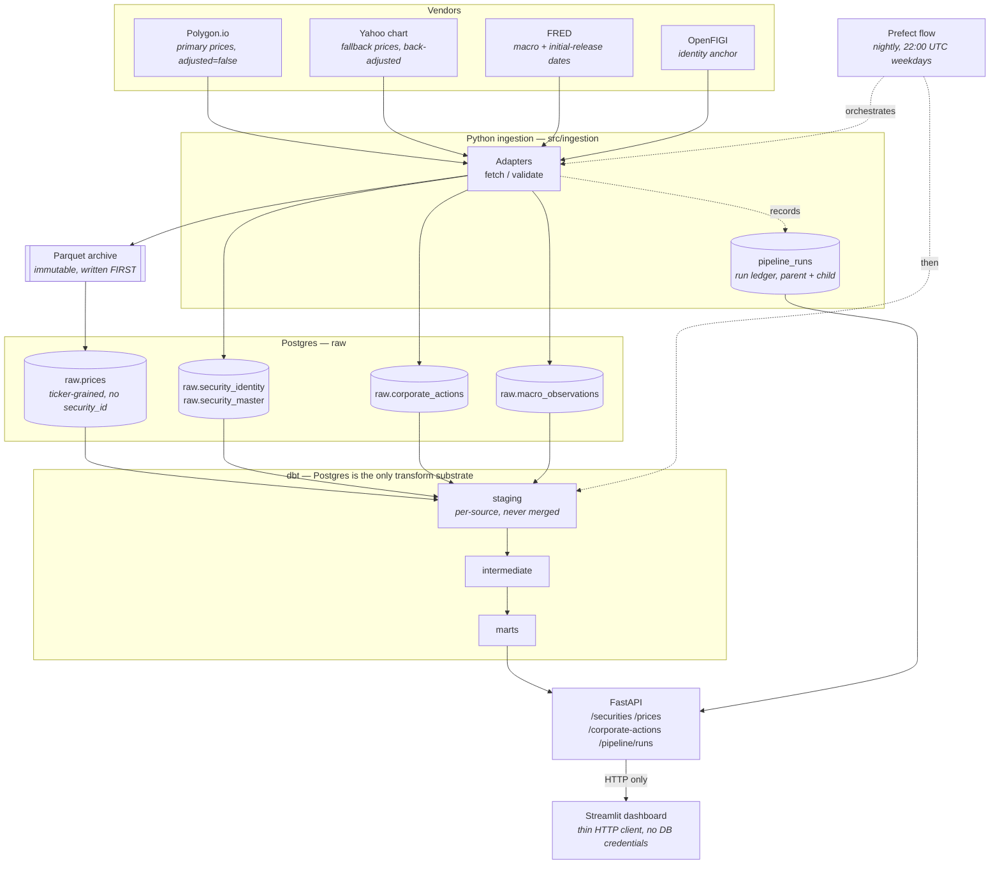
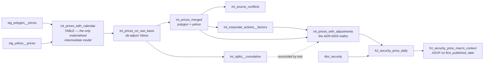

# Design

How this platform is put together, what was rejected on the way, and two worked
examples of defects it catches that would otherwise be **silently wrong** — no
exception, no crash, just a plausible number on the wrong day.

The [README](README.md) is the tour. This is the argument. The
[ADRs](docs/adr/) are the full record; this file distils them.

---

## 1. Architecture



Two edges in that diagram carry most of the design:

**`ADAPT --> ARCHIVE --> RP`, in that order.** Parquet is written *before*
Postgres, so a crash between them leaves an archived file with no database row —
recoverable and detectable — rather than a row whose provenance was never
captured. Postgres is rebuildable from the archive; the archive is not
rebuildable from the vendor, because deep history is rate-limited and paid.
([ADR-0002](docs/adr/0002-parquet-landing-zone.md))

**`API -->|HTTP only| DASH`.** The dashboard holds no database credentials, and
this is enforced by the container rather than by convention: the `dashboard`
compose service deliberately omits `env_file: .env`, so `import
src.common.database` fails inside it with `4 validation errors for Settings`. A
UI with its own query would be a second implementation of "which security is
this ticker" at the one layer a human actually looks at.

### The transform DAG



Three constraints in that shape are not stylistic:

- **The merge sits *after* identity resolution, and that is forced.**
  `int_corporate_actions__factors` joins prices on `(security_id, trading_date)`
  to find a dividend's reference close. A source-grained model there fans out and
  counts every dividend once per vendor, silently doubling the dividend leg of
  the factor product. So the merged model must be `security_id`-keyed.
- **`int_splits__cumulative` and `int_prices_with_adjustments` compute the same
  split product on purpose, and must stay separate.** One undoes *Yahoo's*
  back-adjustment, the other applies *ours*. They are equal only if the two
  vendors' split histories agree — sharing the code would make that agreement
  true by construction and untestable. `assert_split_factors_agree_between_models`
  checks it instead, at exact equality. (It is also the test that caught the
  deliberate break in [PR #2](https://github.com/DomeNemeth/financial-market-platform/pull/2).)
- **`int_prices_with_calendar` is a `table`, alone among the intermediate
  models.** It is read twice per DAG path and its valid-time join is an
  inequality the planner inlines badly. Measured: `int_prices_on_raw_basis` took
  **5.5s as a pure view chain, 0.00s against a materialised base**.

### Cumulative products in SQL

Postgres has no `PRODUCT()` aggregate, so factors are `exp(sum(ln(...)))`,
computed as `exp(total_ln − running_ln)` — subtract in log space, exponentiate
once. That form makes the latest bar's factor **exactly** 1
(`exp(0::numeric) = 1`), so ADR-0003's "the latest bar equals the raw bar" holds
by construction rather than by rounding.

Every log sum is `coalesce(..., 0)`. Without it a security with *no* corporate
actions gets `sum()` over zero rows = NULL, and its entire adjusted series
becomes NULL — the majority case, not an edge case.

---

## 2. What was rejected

Every ADR carries an *Alternatives Considered* section. The strongest rejected
option from each, distilled:

| # | Decision | Strongest alternative rejected | Why |
|---|---|---|---|
| [0001](docs/adr/0001-warehouse-architecture.md) | Postgres as transform substrate | **DuckDB** — columnar, zero-server, reads the Parquet archive directly | Single-writer model: an ingestion run and a dbt run cannot safely overlap, and a long-lived API connection conflicts with both |
| [0002](docs/adr/0002-parquet-landing-zone.md) | Parquet written before Postgres | **Archive raw JSON instead** — higher fidelity, the true wire record | Not queryable without a parse step, compresses worse, loses the schema. `fetch()` does no transformation beyond field selection, so little is discarded |
| [0003](docs/adr/0003-adjusted-price-methodology.md) | Two named series; store factors | **Use Polygon's `adjusted=true`** — less work, better edge cases | The vendor will not say which actions they applied; it changes silently under you, cross-vendor reconciliation becomes impossible, and there is nothing to test. Retained instead as the reconciliation *oracle* |
| [0004](docs/adr/0004-bitemporal-security-master.md) | Valid time and system time modelled separately | **Plain SCD2 on system time only** — the common approach, much simpler | Cannot answer "what was the ticker on this date?" for any change observed later than it occurred — the normal case. It would let the platform *claim* point-in-time correctness while failing the case that matters |
| [0005](docs/adr/0005-prefect-for-orchestration.md) | Prefect, flow parses `run_results.json` | **Trust dbt's exit code** — simpler by a dozen lines | Collapses `warn`/`fail`/`error` into one bit, and this project has a permanent, correct warning. The simple version either fails nightly or forces weakening the test |
| [0006](docs/adr/0006-source-priority-and-conflict.md) | Polygon > Yahoo, one vendor's bar whole | **Average the sources, or field-level best-of** | The mean of two prices on different bases is not a price. Produces a bar no vendor published, reconcilable against neither, and breaks byte-comparability with the archive. See §3 |
| [0007](docs/adr/0007-identifier-strategy.md) | Surrogate key anchored on FIGI | **Generate synthetic CUSIPs with valid check digits** | Rejected emphatically. They pass format validation, look real to any consumer, and are fictional. Recorded specifically so the reasoning is on file |
| [0008](docs/adr/0008-dbt-modeling-conventions.md) | Per-source staging models | **A single merged `stg_prices`** — fewer models, simpler DAG | Forces conflict resolution into staging, where there is no room for it: a `UNION ALL` either duplicates a bar across vendors or silently picks one |
| [0009](docs/adr/0009-api-design.md) | `price_type` required, no default | **Default it to `raw`** — the runner-up | A caller charting the default sees the genuine −90% split artefact: a loud wrong answer. Still an answer the API chose to give. The 422 happens earlier and needs no interpretation |
| [0010](docs/adr/0010-dependency-and-runtime-pinning.md) | Stable ranges, Python 3.11 pinned | **Lock file (`uv.lock` / `pip-tools`)** — the genuinely correct answer | Deferred, not dismissed: the immediate problem was an unbounded *range*, and a lock over a bad range just freezes the bad resolution. Ranges first, lock second |
| [0011](docs/adr/0011-ingestion-failure-policy.md) | Collect-and-continue, then fail the run | **A `PARTIAL` status** — the most precise description of what happened | Every consumer would need to learn a third state, and the common query ("did this run produce complete data?") is binary. `FAILED` plus a row count carries it without widening the contract |
| [0012](docs/adr/0012-macro-data-vintages.md) | ASOF join on `first_published_date` | **Assume a fixed lag per frequency** (monthly = 30 days) | Fabrication. The measured spread — UNRATE ranges 31 to 80 days — makes a constant wrong by weeks in both directions. See §4 |
| [0013](docs/adr/0013-continuous-integration-scope.md) | Real warehouse fixtures, no vendor calls | **Record vendor responses and replay them** so the reconciliation runs in CI | Silently changes what that test *is*. Its value is being an **external oracle**; a frozen recording is our own assertion with extra steps, and could never catch a vendor restatement |

A pattern runs through the rejections: the losing option is usually *simpler*,
and loses because its failure mode is silent. That is the project's whole
disposition — a pipeline that fails loudly beats one that returns a confident
number nobody can reproduce.

---

## 3. Worked example: the two vendors do not report the same quantity

**Without the de-adjustment step, this platform would have adjusted KLAC's
2026-06-12 split twice, and every test would still have passed.**

### The setup

Polygon is fetched with `adjusted=false`, deliberately — raw stays raw, so the
adjustment stays ours and auditable. **Yahoo's chart endpoint has no such flag,
and there is no way to opt out.** Its bars are already back-adjusted for splits
as of the moment of the fetch.

KLA Corporation split 10-for-1 on 2026-06-12. Here is the same session, from both
vendors, as actually measured:

| Vendor | 2026-06-11 close | 2026-06-11 volume |
|---|---|---|
| Polygon (`adjusted=false`) | `2411.64` | `n` |
| Yahoo (no choice) | `241.164` | `10n` |

Exactly a factor of ten on price, inverted on volume. **Neither vendor is wrong.**
They are answering different questions, and nothing in either payload says so.

### What the naive rule does

The obvious fallback rule — *use Polygon where present, Yahoo otherwise* — reads
as clearly correct. Apply it to a window where Polygon is missing a pre-split
session:

1. Yahoo's `241.164` lands in `raw.prices` as the bar for 2026-06-11.
2. `int_corporate_actions__factors` computes the 10:1 split factor for the
   2026-06-12 ex-date. It knows nothing about where the bar came from.
3. `int_prices_with_adjustments` divides the pre-split bar by 10 again.
4. `split_adjusted_close` for 2026-06-11 comes out at **`24.1164`**.

The true answer is `241.164`. The result is wrong by 100×, and it is *still a
number that looks like a price* — a plausible mid-cap quote, in a column named
exactly what a consumer expects, sitting in a chart that renders without
complaint.

Nothing raises. No constraint is violated: it is positive, numeric, within
`NUMERIC(20,6)`, and monotone with its neighbours. Every pre-existing test passes,
because every pre-existing test was written against Polygon-sourced bars.

### What the platform does instead

The merge de-adjusts Yahoo to the raw basis **before** it chooses:

```
stg_polygon__prices ─┐
stg_yahoo__prices   ─┴→ int_prices_with_calendar   (+ source in the grain)
                     → int_prices_on_raw_basis     (de-adjust Yahoo)
                     → int_prices_merged           (priority: polygon > yahoo)
                     → int_source_conflicts        (what the discarded vendor said)
```

Prices multiply and volume divides — the exact inverse of ADR-0003. Getting the
inversion backwards puts the same bar at `24.1164` instead of `2411.64`: wrong by
100×, and still a number that looks like a price. The direction is asserted, not
assumed.

### How it is proven, rather than asserted

`assert_deadjusted_yahoo_reconciles_to_polygon_raw` compares the two vendors over
their overlap. Verified by mutation, with the failure counts measured:

| Mutation | Result |
|---|---|
| Reverse the merge priority (yahoo > polygon) | **258 failures** |
| Invert the de-adjustment (divide instead of multiply) | **exactly 9 failures** — precisely the KLAC pre-split overlap bars |
| Remove the de-adjustment entirely | **10 failures** = the 9 violations + the `VACUOUS` guard row |

That third row is the one worth dwelling on. The test carries a **non-vacuity
guard as a `UNION ALL` branch**: every bar with a de-adjustment factor of 1
reconciles trivially, so a run over only such bars would pass while proving
nothing — and would keep passing if the multiplication were deleted. *The absence
of a real correction to check is itself a failure.* Today that guard is satisfied
by KLAC's nine pre-split overlap sessions, and those nine rows are in the
committed CI fixture for exactly that reason.

### The tolerance that had to be re-measured

The first version used a single `1e-6` bound calibrated on the close alone. It
**failed 79 of 258 bars**. The vendors agree on the *close* to `5.4e-8` — pure
float32 noise — but genuinely disagree on *intraday extremes* by up to `2.8e-5`:
KLAC's 2026-07-30 low is `178.855` at Polygon and `178.86` at Yahoo. Half a cent
apart, and a defect in neither.

So there are three tolerances, each measured rather than guessed: close `1e-6`,
open/high/low `1e-4`, volume `1e-2` (observed max `4.4e-3`). A single tolerance
would have been either too tight to pass or too loose to catch the 100× error
this whole section is about.

---

## 4. Worked example: a macro join that leaks the future

**Without joining on publication date, every backtest built on this warehouse
would be flattered by up to 175 days of hindsight, and nothing would look
wrong.**

### The trap

FRED dates an observation to the **start of the period it describes**, not to
when anyone could know it. January 2026's unemployment rate is dated
`2026-01-01`. It was first published on **2026-02-11**.

An ASOF join on `observation_date` — the obvious one, the one the column name
invites — attaches January's unemployment to every trading day in January.
Including 2026-01-02, six weeks before the number existed.

The measured lags, per series:

| Series | Typical lag | Worst observed |
|---|---|---|
| `UNRATE` | ~35 days | 80 |
| `CPIAUCSL` | ~43 days | — |
| `GDP` | ~121 days | **175** |

A model trained on that join learns to predict January using February's
information. It will backtest beautifully and fail in production, and the failure
will look like alpha decay rather than like a bug.

### What the platform does

`fct_security_price_macro_context` joins on **`first_published_date`**, fetched
from FRED's `output_type=4` initial-release endpoint — the only way to get a real
publication date rather than a guess.

Two consequences are recorded rather than smoothed over:

- **Three of ten series are excluded from the point-in-time join, not given an
  assumed lag.** FRED publishes no initial-release history for calculated series
  (`T10Y2Y`) or the daily Treasuries (`DGS10`, `DGS2`). Assuming a same-day lag
  would be inventing a publication date — the same error class as a fabricated
  CUSIP. The column `supports_point_in_time_join` makes the absence visible in
  query results instead of hiding it in a doc.
- **`value` is the latest revision, not the value as first published**
  ([ADR-0012](docs/adr/0012-macro-data-vintages.md)). The join removes look-ahead
  about a number's *existence*, not about its *value*. `macro_vintage_date` is
  carried per row so a consumer can see which revision they hold. Full replay
  needs every vintage stored, which is **not built** — and is stated here rather
  than implied away.

### How it is proven

`assert_point_in_time_macro_differs_from_naive` is the non-vacuity guard for the
entire macro layer. It **reconstructs the wrong join faithfully** and fails if
the two agree everywhere.

That is the test doing something unusual: it does not check that the right answer
is right, it checks that the right answer is *different from the cheap one*. If
they ever agree, then the publication-date column, the extra FRED request, the
index and the `LATERAL` are all ceremony producing a result a one-line join would
have given — and the reviewer deserves to know that.

In the committed CI fixture, the naive join leaks **18 observations**. The macro
fixture is subset to `observation_date >= 2023-01-01` (3,073 rows instead of
49,335) and that subset was verified to preserve all three of: GDP's full 175-day
maximum lag, a first release before the price window opens for every
point-in-time-capable series, and those 18 leaking observations.

### One more, smaller, in the same family

FRED encodes a missing value as the string `.`. The idiomatic
`pd.to_numeric(errors='coerce')` would turn a genuinely malformed value into a
NULL indistinguishable from a real one, so the sentinel is converted explicitly.

`DGS10` carries one on **2026-07-03** — the observed Independence Day holiday,
the same date that breaks `ex_date - 1 day` in the JPM dividend test. A `0.0`
there would be a ten-year Treasury yield of zero percent: a number that would
sail through every range check on a yield column.

---

## 5. The through-line

Both worked examples have the same shape, and so do most of the rejected
alternatives in §2:

1. There is an obvious implementation that reads as correct.
2. It produces a number of the right type, sign, and magnitude.
3. No exception is raised, no constraint violated, no test fails — *because the
   tests were written against data that does not exercise the defect*.
4. The defect is only visible if you go looking for the specific event that
   triggers it: a split inside the vendor-overlap window, a macro release whose
   publication lag straddles the price window.

Which is why this project's tests are mostly about **data** rather than code, why
its CI loads a real warehouse snapshot rather than an empty schema
([ADR-0013](docs/adr/0013-continuous-integration-scope.md)), and why the
significant tests carry **non-vacuity guards** that fail when the triggering
event is absent from the dataset.

A test that only ever passes proves very little. A test that fails when its own
evidence disappears proves quite a lot.
