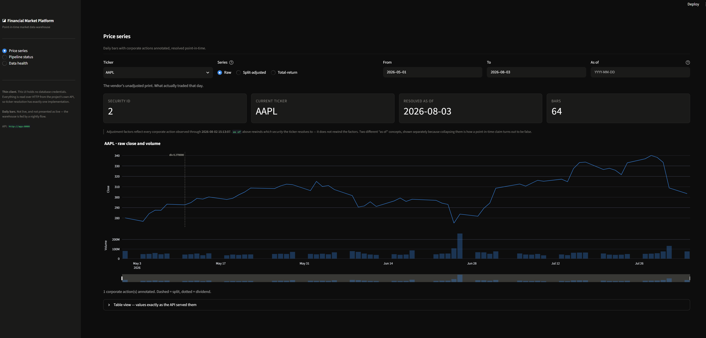
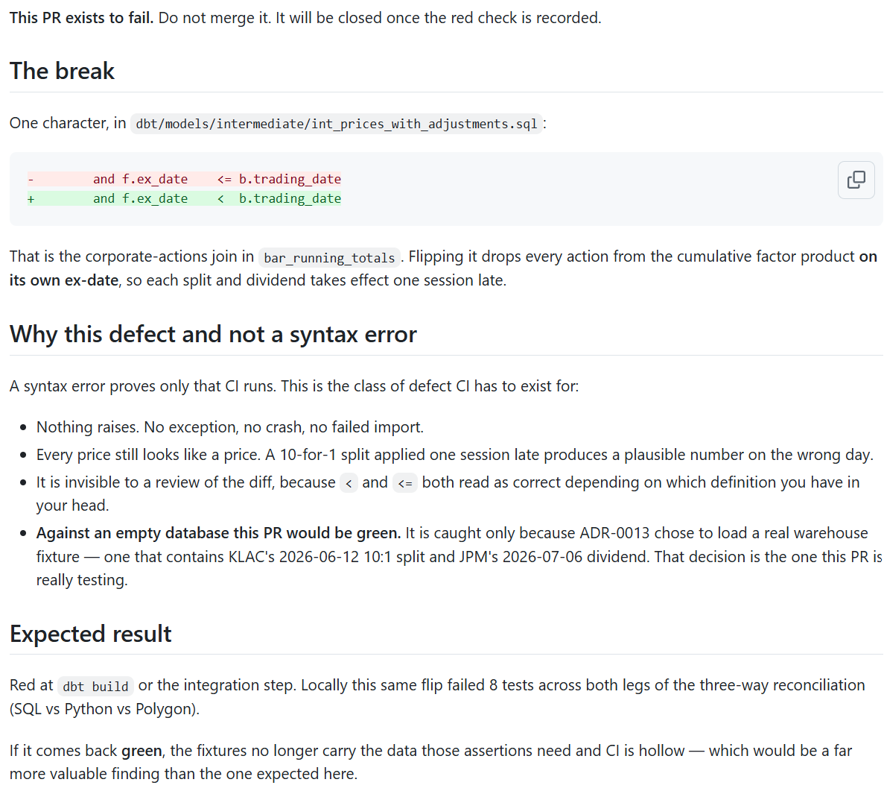

# Financial Market Platform

[](https://github.com/DomeNemeth/financial-market-platform/actions/workflows/ci.yml)

A point-in-time-correct market data warehouse: ingests daily equity bars and
reference data from multiple vendors, reconciles them, and serves them over an
API.

The interesting problem here is not moving rows. It is that market data lies to
you in ways that produce **plausible wrong answers rather than errors** — and a
pipeline that fails loudly is strictly better than one that returns a confident
number nobody can reproduce.

Three concrete examples, all of which this project handles explicitly:

| Trap | What naïvely happens | What it costs |
|---|---|---|
| **Tickers are reused** | `FB` → `META` fragments one company's history; a delisted symbol reassigned to an unrelated company splices two histories into one | A backtest silently runs on a chimera |
| **Corporate actions** | NVDA closed at \$1,208.88 on 2024-06-07 and ~\$120 the next session after a 10:1 split | A −90% return that never happened |
| **Vendors restate** | Today's reference data gets applied to yesterday's prices | Look-ahead bias — the number looks fine and is wrong |

> **Status: v1.0 — all seven phases complete.** Ingestion from three vendors,
> reference data, the dbt transform layer, the point-in-time API, nightly Prefect
> orchestration, a Streamlit dashboard, CI, and branch protection are done and
> tested against live vendor data. **This is a feature-complete portfolio
> project, not a maintained product** — see [Honest status](#honest-status) for
> what is deliberately not built before evaluating it.

That badge is not decorative. CI builds the schema **from empty**, loads a real
warehouse snapshot, and runs the full dbt suite and the integration suite
against it — because most of this project's assertions are about *data*, and a
CI run against an empty database would be green, fast, and meaningless.
[ADR-0013](docs/adr/0013-continuous-integration-scope.md) sets out exactly what
runs and what deliberately does not.

---

## Architecture

```
  Polygon.io ─┐                                                    (primary prices)
  Yahoo chart ┤                                                    (fallback prices)
  FRED ───────┼──▶  Python ingestion  ──┬──▶  Parquet archive   (immutable, written FIRST)
  OpenFIGI ───┘     + run ledger        │            │
                          ▲             └────────────┴──▶  Postgres `raw`  (upserted)
                          │                                        │
                    Prefect flow                                   ▼
                  (nightly, 22:00 UTC)                dbt: staging ─▶ intermediate ─▶ marts
                                                                   │
                                                                   ▼
                                              FastAPI  /securities /prices
                                                       /corporate-actions /pipeline/runs
                                                                   │  HTTP only, no DB creds
                                                                   ▼
                                                        Streamlit dashboard
```

**[DESIGN.md](DESIGN.md) has the same picture as a rendered Mermaid diagram**,
plus the dbt DAG, the alternatives distilled from all thirteen ADRs, and two
fully worked examples of defects that would otherwise be silently wrong.

Every batch is written to **Parquet first, Postgres second**. A crash between
them leaves an archived file with no database row — recoverable and detectable —
rather than a row whose provenance was never captured. Postgres is disposable and
rebuildable from the archive; the archive is not rebuildable from the vendor,
because deep history is rate-limited and paid.

**Postgres is the only transform substrate.** DuckDB is deliberately *not* in the
critical path — it stays available for ad-hoc querying of the Parquet tree.
[ADR-0001](docs/adr/0001-warehouse-architecture.md) covers why, including why
DuckDB's single-writer model rules it out here.

### The data model

| Table | Grain | Purpose |
|---|---|---|
| `raw.prices` | (ticker, trading_date, source) | OHLCV daily bars, unadjusted |
| `raw.security_identity` | security_id | Durable surrogate key, anchored on FIGI |
| `raw.security_master` | (security_id, source) | Current vendor reference snapshot |
| `raw.corporate_actions` | (security_id, action_type, ex_date, source) | Splits and cash dividends |
| `public.pipeline_runs` | run | Every run, success or failure |
| `intermediate.int_prices_with_calendar` | (security_id, trading_date) | Bars resolved to a security_id, checked against the session calendar |
| `intermediate.int_corporate_actions__factors` | (security_id, ex_date) | Per-event split and dividend factors |
| `intermediate.int_prices_with_adjustments` | (security_id, trading_date) | The ADR-0003 adjustment maths |
| `marts.dim_security` | security_id | Current-state dimension, both time axes exposed |
| `marts.fct_security_price_daily` | (security_id, trading_date) | Raw OHLCV + factors + both adjusted series |

`security_id` — not the ticker — is the join key everywhere. Tickers are *leased*
by exchanges and get reassigned, so joining on them is silently incorrect.
Identity is anchored on **FIGI** (free and redistributable via OpenFIGI); a
security seen before its FIGI resolves gets a *provisional* identity that is later
promoted **in place**, so no foreign key is ever invalidated.

CUSIP and ISIN columns exist and are **always NULL** in this deployment. They are
licensed identifiers, and a checksum-valid fake is worse than an empty column
because it looks usable. See
[ADR-0007](docs/adr/0007-identifier-strategy.md).

---

## Quickstart

**Prerequisites:** Docker Desktop, Python 3.11, and a free
[Polygon.io](https://polygon.io) API key. An
[OpenFIGI](https://www.openfigi.com/api) key is optional but raises the rate
limit from 25 to 250 requests/minute.

```bash
git clone <repo> && cd financial-market-platform
cp .env.example .env          # then add your POLYGON_API_KEY

python -m venv .venv
.venv/Scripts/python.exe -m pip install -e ".[dev]"     # Windows
# .venv/bin/python -m pip install -e ".[dev]"           # macOS / Linux

docker compose up -d
.venv/Scripts/python.exe -m src.common.migrate          # create the schema

curl http://localhost:8000/health
# {"status":"ok","db":"connected"}
```

> Postgres publishes on host port **5433**, not 5432, so it coexists with a
> locally-installed Postgres. Change it in `.env` and `docker-compose.yml` if you
> prefer 5432.

Interactive API docs are at <http://localhost:8000/docs>.

### Ingest some data

```bash
PY=.venv/Scripts/python.exe

# Reference data first — corporate actions need a security_id to attach to
$PY -m src.ingestion.security_master   --tickers AAPL MSFT NVDA
$PY -m src.ingestion.corporate_actions --tickers NVDA --since 2020-01-01

# Prices: one API call covers the whole range
$PY -m src.ingestion --tickers AAPL MSFT NVDA --start 2026-06-01 --end 2026-06-30
```

Re-running any of these is safe. Loads are `INSERT ... ON CONFLICT` upserts, so a
repeat run updates in place rather than duplicating — verified by tests, not just
asserted.

### Build the warehouse

```bash
./scripts/dbt.ps1 build     # seed + snapshot + run + test
```

`scripts/dbt.ps1` exists because dbt's `env_var()` reads real OS environment
variables, not `.env`. Call it rather than bare `dbt`. On CI, where variables are
set natively, `dbt` works directly.

---

## Running it nightly

Everything above in one command — ingest all three vendors, then rebuild and
test the warehouse:

```bash
python -m orchestration.flows.daily_ingest
```

Or as a scheduled deployment (three terminals, in this order):

```bash
prefect server start
prefect worker start --pool local-process
prefect deploy --all                        # once, to register
prefect deployment run 'daily-ingest/nightly'
```

The schedule is `0 22 * * 1-5` UTC — after the 16:00 ET close, weekdays only.

Three things the flow does that a shell script wrapping the same four commands
would get wrong, all decided in [ADR-0005](docs/adr/0005-prefect-for-orchestration.md):

- **A dbt `WARN` does not fail the run; a `FAIL` or `ERROR` does.** The flow
  parses `run_results.json` rather than reading dbt's exit code, because this
  project has a permanent and *correct* warning and one bit cannot tell it apart
  from a real failure. It also checks the artifact is newer than the run that
  should have written it — a stale one reports a clean build for a dbt that died
  before starting.
- **dbt still runs when one vendor fails**, because the Yahoo fallback exists so
  that Polygon failing is survivable. It is skipped only when *every* source
  failed, which is systemic and where a rebuild would bury the real cause under
  a downstream data-quality failure.
- **A partial-batch failure is never retried.** Under
  [ADR-0011](docs/adr/0011-ingestion-failure-policy.md) it is raised only after
  the successful tickers have committed, so retrying re-pays Polygon's
  five-requests-per-minute rate limit to re-attempt a deterministic failure.

Each run writes one parent row in `pipeline_runs` and a child row per step, so
`/pipeline/runs` answers both "did last night work" and "which source broke".

---

## Querying the API

Two endpoints carry the data contract, and both of them make a point.

```bash
# Which security holds this ticker? Resolved as of a date you control.
curl 'http://localhost:8000/securities/KLAC'

# The same window, in two different series.
curl 'http://localhost:8000/prices/KLAC?price_type=raw&start=2026-06-11&end=2026-06-12'
curl 'http://localhost:8000/prices/KLAC?price_type=split_adjusted&start=2026-06-11&end=2026-06-12'
```

Those last two straddle KLA's 10-for-1 split on 2026-06-12, and they disagree —
which is the entire point:

| `trading_date` | `raw` close | `split_adjusted` close |
|---|---|---|
| 2026-06-11 | 2411.640000 | 241.1640000000000000 |
| 2026-06-12 | 254.540000 | 254.5400000000000000 |

The raw series contains a −89.4% overnight move that never happened to anyone's
wealth. The adjusted one does not. Neither is "wrong" — they answer different
questions, which is why you have to say which one you want.

**`price_type` is required. There is no `?adjusted=true`.** Omitting it is a 422,
not a default:

```bash
curl 'http://localhost:8000/prices/KLAC'
# {"error":"validation_error","message":"Request validation failed.",
#  "details":[{"type":"missing","loc":["query","price_type"],"msg":"Field required"}]}
```

Any default would be the API silently choosing a series on your behalf, and the
three choices are not interchangeable: `split_adjusted` is for charting and price
levels, `total_return_adjusted` is for returns, `raw` is what the vendor sent.
`total_return_adjusted` returns an explicit `null` for open/high/low/vwap,
because a dividend factor is defined against the previous session's close and has
no intraday analogue — a null says "this does not exist" where a substituted
value would assert something false.

**`as_of` decides which security a ticker resolves to**, against the security's
list/delist window — never a bare ticker match. It defaults to `end`, or to today
when the window is open-ended, so a historical query about a delisted company
answers about *that* company rather than whoever later inherited its symbol. A
ticker that resolves to nothing is a 404; one that resolves to *several* is a
**409**, because picking one is precisely the splice the platform exists to
prevent.

Prices cross the wire as **JSON strings, not numbers** — JSON's only numeric type
is an IEEE-754 double, and these are decimals. Parse them as decimals.

[ADR-0009](docs/adr/0009-api-design.md) covers the full contract, including the
error envelope and what `as_of` deliberately does *not* do.

`/pipeline/runs` surfaces the run ledger and is deliberately **untyped** — it is
an operational endpoint whose value is showing whatever the ledger recorded, not
a shape to build against.

---

## The dashboard



*Price series, `raw`. The header tiles are the point-in-time contract made
visible: `SECURITY ID 2` is what the ticker resolved to, `RESOLVED AS OF` is
which date decided that, and the caption beneath separates it from
`actions_observed_through` — two different "as of" concepts, shown separately
because collapsing them is how a point-in-time claim turns out to be false.*

```bash
docker compose up -d          # Postgres + API + dashboard
# http://localhost:8501
```

Three pages, narrowed from the five originally planned. The backend accumulated
enough substance over five phases that a wide, shallow UI would have undersold
it; three pages that each say something specific beat five that each show a
table.

| Page | What it is for |
|---|---|
| **Price series** | Daily bars in any of the three series, with corporate actions annotated on the chart. The argument for ADR-0003 in a form that does not require reading ADR-0003: the raw KLAC series shows a −90% cliff on 2026-06-12, the split-adjusted series runs straight through it, and the annotation names the 10-for-1 responsible. |
| **Pipeline status** | The run ledger, with parent/child rows so it answers both "did last night work?" and "which source broke?". A `FAILED` run with a non-zero row count is shown as exactly that, because under ADR-0011 it is the policy working. |
| **Data health** | Coverage and freshness per security, split by vendor. A high fallback share means `vwap` and `trade_count` are mostly absent — Yahoo does not publish them and this platform does not invent them. |

**It is a thin HTTP client and holds no database credentials.** That is the
central decision, and the shortcut was tempting: Streamlit runs Python,
`src.common.database` is right there, and a direct `SELECT ... WHERE
vendor_ticker = ...` would have been three lines and would have worked. It would
also have been a second, unresolved implementation of "which security is this
ticker" — the exact bare-ticker join that
[`src/api/resolution.py`](src/api/resolution.py) exists to prevent —
reintroduced at the one layer a human actually looks at. The chart would render,
the numbers would look like prices, and nobody would see the splice.

So the dashboard is the API's first real consumer, which makes it a test of the
API's ergonomics as well as a view of the data. It required exactly one new
endpoint, [`/corporate-actions/{ticker}`](src/api/routers/corporate_actions.py),
which resolves through the same `resolve_security` as everything else — so
overlaying annotations on a price series is sound rather than coincidental.

**And the constraint is enforced, not merely documented.** The `dashboard`
service deliberately does not load `.env`, so the container has no `POSTGRES_*`
variables and no API key. Inside it, `import src.common.database` fails outright
with a pydantic `4 validation errors for Settings`. A future refactor cannot
quietly open a database connection from the UI, because there is nothing to
connect with — which is a stronger guarantee than a promise in a code review.

**The error paths are part of the design, not an afterthought.** A 404 explains
that no security held the ticker *on that date* and that the fix is usually to
move `as of`, not to retype the symbol. A 409 lays both claimants side by side
and names it as a data defect the API refuses to guess past — the direction a
broken implementation never even reaches, because it would have returned one of
them and looked perfectly healthy.

---

## Testing

```bash
PY=.venv/Scripts/python.exe

$PY -m pytest -m "not integration"                        # 57 unit tests — no network, no database
$PY -m pytest tests/integration -m "not live_vendor"      # 80 tests — needs the stack; no vendor calls
$PY -m pytest tests/integration -m live_vendor            # 13 tests — needs a Polygon key. Local only.
./scripts/dbt.ps1 build                                   # 143 nodes, 1 expected WARN
$PY -m ruff check src/ tests/ scripts/ orchestration/
```

**`live_vendor` is a declared boundary, not an incidental skip.** Exactly one
test file calls a vendor for real —
[`test_split_reconciliation.py`](tests/integration/test_split_reconciliation.py),
whose value *is* that it checks our arithmetic against Polygon's own adjusted
close as an independent oracle. It is deselected in CI so a vendor outage can
never turn the build red for a reason outside the diff. Recording the response
as a fixture was rejected: a frozen copy of the oracle's answer is no longer
independent, and could never catch a vendor restatement.

A few of these are worth calling out, because a test suite that only passes is
not evidence of much:

- **The missing-trading-day test failed on its first run** and was right to. It
  found that AAPL had a lone 2026-07-29 bar with all of July missing behind it.
  It compares observed dates against a committed exchange-calendar seed, bounded
  per ticker to its own observed range so it detects *interior* gaps rather than
  flagging every session before ingestion began.
- **Split adjustment is reconciled against Polygon's own adjusted close** to
  1e-6 relative, on a real 10-for-1 split — with explicit guards that the window
  actually straddles the split and that the raw series really does contain the
  ~−90% artefact being corrected. Without those guards the test could pass while
  proving nothing.
- **Intra-batch duplicate handling is verified against the actual failure.**
  Postgres raises `CardinalityViolation` if one statement presents two rows with
  the same conflict key, aborting the whole batch. Vendors do return duplicates
  from overlapping paginated ranges.
- **Partial-batch failure asserts both halves of the policy**: successful tickers
  are committed *and* the run is still recorded `FAILED`. Either one alone is the
  wrong behaviour.
- **The point-in-time API test asserts an outcome, not a status code.** It builds
  a ticker held by two unrelated companies over disjoint windows and checks that
  `as_of` returns *different securities* — plus that a date in the gap between
  the two listings is a 404 rather than a plausible answer. Verified non-vacuous
  by reverting the resolver to a bare ticker match, which fails 7 of its 13
  assertions.
- **The `price_type` contract is checked as a disagreement between responses**,
  not as a property of one. Serving the same column for two `price_type` values
  cannot satisfy it. Verified the same way: pointing `split_adjusted` at the raw
  columns fails 4 integration assertions and 1 unit assertion.

### Proving CI catches something

A green badge proves a workflow ran, not that it would notice anything. So one
PR was opened to fail on purpose, and is [left closed rather than
deleted](https://github.com/DomeNemeth/financial-market-platform/pull/2) so the
red check stays on the record.



The break was one character — `f.ex_date <= b.trading_date` to `<` — which drops
every corporate action from the factor product **on its own ex-date**, so each
split and dividend takes effect one session late. Nothing raises. Every price
still looks like a price. **Against an empty database that PR would have been
green**; it is caught only because CI loads a real warehouse fixture containing
KLAC's 10-for-1 split and JPM's holiday-straddling dividend.

Result: red at `dbt build` in 1m15s, `PASS=118 WARN=1 ERROR=1 SKIP=23`, and the
merge blocked (`mergeStateStatus=BLOCKED`) despite the author being the repo
owner, because branch protection sets `enforce_admins: true`. The enforced rule
is committed at
[`.github/branch-protection.json`](.github/branch-protection.json).

The defect was caught by `assert_split_factors_agree_between_models` — *not* by
the reconciliation tests it was aimed at, which never ran because dbt failed
first. That test exists only because
[ADR-0006](docs/adr/0006-source-priority-and-conflict.md) refuses to share code
between two models that compute the same split product for different reasons.
Merging them would have made their agreement true by construction, and this
defect would have surfaced later and more noisily.

---

## Interview talking points

If you are reading this to evaluate the engineering rather than to run it, these
five are where the substance is. Each is a decision with a rejected alternative,
a measured consequence, and a test that fails when it is undone.

| # | Decision | Why it is interesting | Where |
|---|---|---|---|
| 1 | **The two vendors do not report the same quantity** | Polygon is fetched unadjusted; Yahoo's chart endpoint has no such flag and cannot opt out. Measured on KLAC's 10-for-1: Yahoo's pre-split close is `241.164` where Polygon's is `2411.64`. A naive "Polygon where present, Yahoo otherwise" rule adjusts that bar twice and lands it at `24.1164` — wrong by 100×, still a plausible price, and **every pre-existing test would have passed**. So the merge de-adjusts before it chooses. Proven by mutation: reversing priority → 258 failures; inverting the de-adjustment → exactly 9 | [DESIGN §3](DESIGN.md#3-worked-example-the-two-vendors-do-not-report-the-same-quantity) · [ADR-0006](docs/adr/0006-source-priority-and-conflict.md) |
| 2 | **The macro join uses publication date, never observation date** | FRED dates an observation to the start of the period it describes. January 2026 unemployment is dated `2026-01-01` and was published `2026-02-11`. Joining on the obvious column leaks up to **175 days** of hindsight (GDP's worst case) into any backtest, and it backtests *beautifully*. Three of ten series are excluded rather than given an assumed lag, because inventing a publication date is the same error class as fabricating a CUSIP | [DESIGN §4](DESIGN.md#4-worked-example-a-macro-join-that-leaks-the-future) · [ADR-0012](docs/adr/0012-macro-data-vintages.md) |
| 3 | **Nothing is called `adjusted_close`, and `price_type` has no default** | Two named series — `split_adjusted_*` for charting, `total_return_adjusted_*` for returns — because collapsing them is the most common way adjusted-price data gets misused. The API refuses to guess: omitting `price_type` is a 422. The runner-up was defaulting to `raw`, which would at least fail loudly; rejected because a loud wrong answer is still an answer the API chose to give | [ADR-0003](docs/adr/0003-adjusted-price-methodology.md) · [ADR-0009](docs/adr/0009-api-design.md) |
| 4 | **Ticker resolution is point-in-time, and exists exactly once** | `where ticker = :ticker` never raises while being wrong. Resolution is bounded by the security's valid-time window: zero matches is a 404, several is a **409**. The test asserts an *outcome* — a ticker held by two unrelated companies over disjoint windows must return different securities, and a date in the gap year between them must 404. Reverting to a bare ticker match fails 7 of its 13 assertions. The dashboard holds no DB credentials specifically so this cannot be reimplemented in the UI | [ADR-0009](docs/adr/0009-api-design.md) · [`src/api/resolution.py`](src/api/resolution.py) |
| 5 | **Tests carry non-vacuity guards, and CI runs on real data** | A test that only ever passes proves little. `assert_deadjusted_yahoo_reconciles_to_polygon_raw` fails if no bar in the dataset needs a real correction — *the absence of evidence is itself a failure*. `assert_point_in_time_macro_differs_from_naive` reconstructs the wrong join and fails if the two agree. This is why CI loads a real warehouse snapshot: against an empty database the suite is green, fast, and meaningless | [ADR-0013](docs/adr/0013-continuous-integration-scope.md) · [DESIGN §5](DESIGN.md#5-the-through-line) |

The honest counterweight to all five is [Honest status](#honest-status), which
lists what is not built and what is known-limited. Both lists are maintained
deliberately.

---

## Design decisions

Written up as ADRs, with the alternatives that were rejected and why:

| ADR | Decision |
|---|---|
| [0001](docs/adr/0001-warehouse-architecture.md) | Postgres as the transform substrate; DuckDB out of the critical path |
| [0002](docs/adr/0002-parquet-landing-zone.md) | Parquet as an immutable landing zone, written before Postgres |
| [0003](docs/adr/0003-adjusted-price-methodology.md) | Two named adjusted series; store factors, not adjusted prices |
| [0004](docs/adr/0004-bitemporal-security-master.md) | Bitemporal security master — valid time and system time kept separate |
| [0005](docs/adr/0005-prefect-for-orchestration.md) | Prefect over Airflow; a dbt `WARN` never fails the flow, a `FAIL` always does |
| [0006](docs/adr/0006-source-priority-and-conflict.md) | Polygon primary, Yahoo fallback; de-adjust before choosing; never average |
| [0007](docs/adr/0007-identifier-strategy.md) | Surrogate key anchored on FIGI; licensed identifiers never fabricated |
| [0008](docs/adr/0008-dbt-modeling-conventions.md) | Per-source staging models; cross-source merging only at intermediate |
| [0009](docs/adr/0009-api-design.md) | Required `price_type` enum; `as_of` resolves valid time only; one error envelope |
| [0010](docs/adr/0010-dependency-and-runtime-pinning.md) | Stable-only dependency ranges and a pinned interpreter |
| [0011](docs/adr/0011-ingestion-failure-policy.md) | Collect-and-continue on partial failure, then fail the run |
| [0012](docs/adr/0012-macro-data-vintages.md) | Macro joins on publication date, never observation date; no assumed lags |
| [0013](docs/adr/0013-continuous-integration-scope.md) | What CI runs; real fixtures over synthetic; no vendor calls in CI |

**All thirteen ADRs are written; none are stubs**, and ADR-0003 carries an
addendum on computing the factor products in SQL. [DESIGN.md](DESIGN.md) distils
the strongest rejected alternative from each into one table.

Two decisions that are load-bearing enough to summarise here:

**Nothing is called `adjusted_close`.** There are two series —
`split_adjusted_*` for charting and price-level comparison, and
`total_return_adjusted_*` for returns. Collapsing them into one ambiguously-named
column is the single most common way adjusted-price data gets misused. The mart
stores raw OHLCV plus the cumulative *factors*, so a new corporate action
recomputes factors instead of rewriting history.

**The adjustment maths is implemented twice on purpose.**
[`src/transforms/adjusted_prices.py`](src/transforms/adjusted_prices.py) is a
pure-Python reference implementation — `Decimal` throughout, readable, directly
unit-testable — and dbt SQL implements it again for the pipeline. Disagreement
between the two is a real signal. This is a deliberate exception to "transform in
dbt", not a pattern.

Both implementations are now live, and
[`tests/integration/test_split_reconciliation.py`](tests/integration/test_split_reconciliation.py)
reconciles them three ways: SQL against Python over identical staged bars, and
each against Polygon's own adjusted series as an external oracle. The SQL side
computes the cumulative product as `exp(sum(ln(...)))`, because Postgres has no
`PRODUCT()` aggregate — a technique with three failure modes, two of which fail
silently. They are measured and documented in the
[addendum to ADR-0003](docs/adr/0003-adjusted-price-methodology.md#addendum-computing-the-factor-products-in-sql).

---

## Project layout

```
migrations/          Numbered, forward-only, checksummed SQL migrations
src/
  common/            config, database, logging, TLS, trading calendar, migrate
  ingestion/         Polygon + Yahoo adapters, FRED, security master, corporate actions, run ledger
  transforms/        Pure-Python adjusted-price reference implementation
  api/               FastAPI app: resolution, routers, response schemas
  dashboard/         Streamlit UI — thin HTTP client, no database access
    views/           The three pages (not `pages/`: Streamlit treats that name as magic)
dbt/
  models/staging/       Per-source staging models
  models/intermediate/  Identity resolution, calendar checks, adjustment maths
  models/marts/         dim_security, fct_security_price_daily, macro marts + ASOF join
  snapshots/         SCD2 security master history
  seeds/             Committed trading calendar
  tests/             Singular data tests
orchestration/
  flows/             Prefect flows (daily_ingest)
prefect.yaml         Deployment definition and cron schedule
docs/adr/            Architecture decision records
scripts/
  export_ci_fixtures.py  Snapshot a live warehouse into the CI fixture set
  load_ci_fixtures.py    Replay it through the production write path, then verify
.github/workflows/ci.yml  Schema from empty -> fixtures -> dbt build -> tests -> lint
tests/unit/          No network, no database
tests/integration/   Needs the stack; `live_vendor` marks the ones that call a vendor
tests/fixtures/ci/   The committed warehouse snapshot CI runs against
```

Schema changes go in `migrations/`, never in `docker/postgres/init.sql` — the
Postgres entrypoint only runs `init.sql` when the data directory is empty, so
editing it cannot reach a database that already exists. Applied migrations are
immutable; the runner rejects one whose checksum has changed.

---

## Honest status

**Working and verified against live vendor data:**
Polygon price ingestion (range-based, idempotent, rate-limit aware) · Parquet
archive · security master with real OpenFIGI resolution · corporate actions
(splits and dividends) · SCD2 snapshot · trading calendar · migration runner ·
run ledger · full dbt DAG from staging through intermediate to marts, with both
adjusted series reconciled against the Python reference and against Polygon ·
point-in-time API over `dim_security` and `fct_security_price_daily` ·
a three-page Streamlit dashboard reading only over HTTP ·
CI that builds the schema from empty and runs the whole suite against real data ·
branch protection requiring that CI, proven against a deliberately broken PR ·
123 dbt data tests · 150 Python tests.

Last full local sweep, **2026-08-09**, against a live database and real vendor
data rather than mocks:

| Check | Result |
|---|---|
| `ruff check src/ tests/ scripts/ orchestration/` | clean |
| `pytest -m "not integration"` | **57 passed** |
| `pytest tests/integration -m "not live_vendor"` | **80 passed, 0 skipped** |
| `pytest tests/integration -m live_vendor` | **13 passed** (real Polygon calls) |
| `dbt build` | **PASS=142 WARN=1 ERROR=0 SKIP=0**, 143 nodes |
| CI on `main` | green |

`0 skipped` is the assertion, not `80 passed` — several integration tests
`pytest.skip` themselves when their data is absent, so a warehouse that had lost
a fixture would leave a green run that proved nothing.

**Not built yet:**

- **Alpha Vantage.** Polygon (primary), Yahoo (fallback) and FRED (macro) are
  in. Alpha Vantage was in the original Phase 5 scope and is not built. The
  merge layer it would plug into is finished and vendor-agnostic — adding it is
  one staging model plus one line in `int_prices_merged`'s priority `case` — so
  it is deferred rather than blocked.
- **The API has no endpoint that lists securities**, so the dashboard's data
  health page iterates a configured ticker list (`DASHBOARD_TICKERS`) rather
  than discovering the universe the way the Prefect flow does. Drift between
  that list and the warehouse is surfaced as an error row rather than hidden — a
  ticker that fails to resolve is shown with its reason, because a silently
  shorter list looks like a clean warehouse.
- **CI fixtures are a snapshot and nothing refreshes them.**
  `scripts/export_ci_fixtures.py` regenerates them from a live warehouse in one
  command, and refuses to run if that warehouse has lost any fact the test
  suites depend on. Until it is re-run, CI tests against 2026-08-05 data.
- **The Quickstart has not been run on a clean machine.** CI builds the schema
  from empty on a fresh runner every commit, but that is Linux with environment
  variables set natively — not the same claim as following the Quickstart
  end-to-end on an unfamiliar box. Verified by inspection rather than by
  execution.
- **The `trading_calendar` seed expires on 2027-08-02.**
  `exchange_calendars` only generates about a year forward, so the committed
  seed is clamped there. Past that date `assert_no_missing_trading_days` starts
  failing on sessions the calendar does not know about. This is the one thing
  here that breaks with the passage of time rather than with a decision.
- **The Prefect worker is a process someone must keep running.** A laptop
  deployment is not high availability, and ADR-0005 says so.
- **No auth, no rate limiting, no pagination on the API.** `/prices` caps a
  response at 5,000 bars and *rejects* anything larger rather than truncating it;
  pagination will replace that cap rather than sit beside it.

**Known limitations:**

- Only splits and cash dividends are handled. Spin-offs, mergers, rights issues,
  and return-of-capital are **not**, and would produce a wrong series if present.
  A stated scope limit, not an oversight.
- Polygon's free tier caps aggregates at two years; reference endpoints are
  uncapped. This is why the split reconciliation uses a 2026 event rather than
  NVDA's canonical 2024 split.
- If a provisional identity later resolves to a FIGI that already exists under a
  different `security_id`, the two rows need merging. This is **detected but not
  repaired** — see [ADR-0004](docs/adr/0004-bitemporal-security-master.md).
- The Parquet archive's immutability is a convention enforced by a single writer,
  not by filesystem permissions. No archive-to-`raw` reconciliation check exists yet.
- **`as_of` rewinds valid time only.** It decides which security held a ticker on
  a date; it does *not* replay what the platform believed then, and it does not
  recompute adjustment factors from only the corporate actions known by then. So
  a response's adjusted prices reflect every action currently in the warehouse.
  Every price response carries `actions_observed_through` saying exactly which
  observation cutoff its factors came from, rather than leaving the gap silent.
  The full bitemporal replay needs an observation filter in the transform layer
  that does not exist yet — [ADR-0009](docs/adr/0009-api-design.md) explains why
  doing half of it would be worse than doing none.
- **Macro vintages are not stored, and that deferral has now expired.**
  [ADR-0012](docs/adr/0012-macro-data-vintages.md) deferred "store every vintage"
  to Phase 6 on size grounds. Phase 6 shipped without it and the project closed
  at v1.0, so the ADR's deferral target is stale — recorded here rather than
  quietly left pointing at a phase that came and went. The consequence is
  unchanged and bounded: the point-in-time join removes look-ahead about a
  number's *existence*, not about its *value*, and `macro_vintage_date` is
  carried per row so a consumer can see which revision they hold.
- The total-return series has **no external oracle**. Polygon's adjusted
  aggregates are split-only, so the dividend leg is checked against the Python
  reference and against a definitional property (on the session before an
  ex-date, the total-return close equals close minus the dividend) rather than
  against a third party.
- `assert_dividend_factors_have_a_reference_close` warns on 138 rows and is
  *expected* to. Corporate actions are ingested from 2020 while prices cover
  weeks, so most historical dividends have no bar behind them; ADR-0003 skips
  those with no factor applied. The count should only ever shrink as price
  history is backfilled — it has, from 142. Neither CI nor the Prefect flow
  fails on a dbt `WARN`, and neither asserts the count: pinning it would turn
  honest reporting into a brittle test, since it moves legitimately whenever the
  ingestion window does.
- **CI does not test the vendor adapters against the vendors.** A breaking change
  to Polygon's response shape is caught by the nightly flow failing, not by CI.
  That is the correct division — CI tests this repository, and a vendor changing
  its API is not a property of a commit.
- **The dashboard is dark-mode only.** A deliberate choice rather than an
  oversight; its palette is validated against one surface, and contrast results
  are only meaningful against the surface a chart actually renders on.

---

## Roadmap

1. ✅ Foundation — Docker, Postgres, run ledger, Polygon adapter
2. ✅ Reference data — security master, corporate actions, trading calendar
3. ✅ Transform layer — dbt intermediate → marts, adjusted prices in SQL
4. ✅ API layer — point-in-time prices endpoint → `v0.5`
5. ✅ Completeness — Yahoo fallback, FRED macro, Prefect orchestration → `v0.7`
6. ✅ Polish — Streamlit dashboard, CI/CD → `v0.8`
7. ✅ Release — docs, ADRs, verification sweep → `v1.0`

**The project is finished as scoped.** [Honest status](#honest-status) is what a
Phase 8 would start from, and it is not planned — that list is maintained as
carefully as the feature list, and is not a backlog.

---

## License

[MIT](LICENSE).
